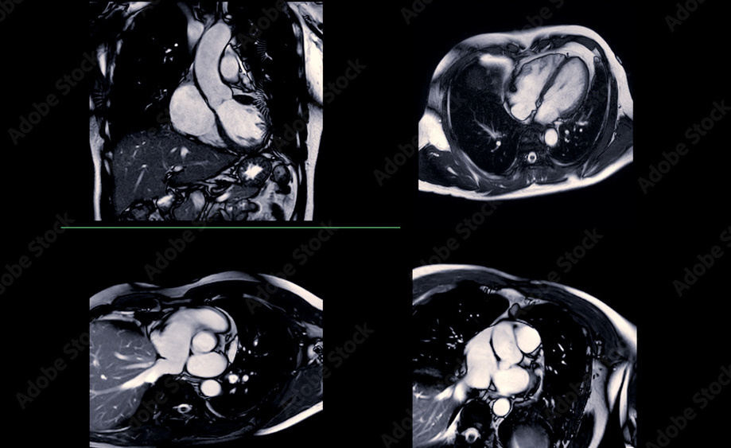

```{r}
#| echo: false
#| message: false

library(tidyverse)
library(ggplot2)
library(leaflet)
library(patchwork)
library(dplyr)
library(stringr)
library(lubridate)
library(tidytext)
library(textdata)
library(igraph)
library(ggraph)
library(treemapify)
library(threejs)
library(htmlwidgets)
library(visNetwork)

jcmr <- read_csv("~/project-2/ScrollyTelling/clean_jcmr.csv")
```

::::: {style="--cr-narrative-font-size:var(--size-normal);--cr-narrative-font-family:Mulish;"}

::::{.cr-section layout="sidebar-right"}

@cr-title

:::{#cr-title .large-fixed-text-left}
Journal of Cardiovascular Magnetic Resonance **Text Analysis**

<br>

<span class= "medium-fixed-text">SDS 264 Spring 2026.</span>
:::

Cynthia Budiyanto and Willemijn Leiner

::::

::::{.cr-section layout="sidebar-right"}

@cr-rationale

::: {#cr-rationale .large-fixed-text-left}
Understanding the progression of <span style="color:#6EAB8A">*AI*</span> and <span style="color:#6EAB8A">*Machine Learning*</span> development in the Cardiovascular Magnetic Resonance field
:::

{width="100%"}
::::

:::::

::::{.cr-section layout="overlay-center"}

:::{#cr-photo1 .fullpage}

:::

:::{.progress-block}

Artificial Intelligence has transformed medical imaging, and cardiac MRI (magnetic resonance imaging) is one of the most active frontiers. @cr-photo1

It is essential to examine how research on cardiovascular imaging methods development has evolved recently and how knowledge within this field is being generated.

By utilizing text analysis and natural language processing, we can interpret large volumes of textual data regarding design, development, manufacture, and evaluation of cardiovascular imaging technologies. 

Journal of Cardiovascular Magnetic Resonance (JCMR) is a leading publication site for basic, translational, and clinical research on cardiovascular magnetic resonance (CMR) methods.

Our goal is to transform this large set of unstructured data into well‐organized, accessible, and meaningful insights. 

We want to highlight the growing role of AI and Machine Learning in the development of CMR, particularly for audiences outside the research and medical imaging communities.

:::
::::

::::{.cr-section layout="sidebar-right"}
@cr-linechart

:::{#cr-linechart}
```{r}
#| echo: false
#| message: false
#| warning: false
#| fig.width: 10
#| fig.height: 6

jcmr_yearly <- jcmr |>
  mutate(year = year(date)) |>
  filter(!is.na(keyword), !is.na(year)) |>
  group_by(year, keyword) |>
  summarise(n = n(), .groups = "drop")

ggplot(jcmr_yearly, aes(x = year, y = n, color = keyword)) +
  geom_line(linewidth = 1.2) +
  geom_point(size = 2) +
  scale_color_manual(values = c(
    "machine learning" = "seagreen",
    "deep learning" = "skyblue",
    "artificial intelligence" = "cornflowerblue",
    "convolution" = "#A67BB8"
  )) +
  labs(
    title = "Growth of AI-Related Publications in JCMR",
    x = "Year",
    y = "Number of Articles",
    color = "Keyword"
  ) +
  theme_minimal(base_size = 14) +
  theme(
    legend.position = "bottom",
    plot.title = element_text(face = "bold")
  )
```
:::

Before 2017, AI-related publications in cardiac MRI were rare, except for when convolution was mentioned

Around 2017, deep learning matured and publication volume surged.

After 2020, all four keywords were appearing at way higher rates.
::::

::::{.cr-section layout="sidebar-right"}
@cr-barchart

:::{#cr-barchart}
```{r}
#| echo: false
#| message: false
#| warning: false
#| fig.width: 10
#| fig.height: 8

# Stop words setup
cmr_stopword <- c("study", "scientific", "high", "increased", "induced", 
                  "levels", "expression", "potential", "treatment", "related", 
                  "significantly", "accumulation", "showed", "specific", "yrs", 
                  "age", "effect", "effects", "results", "analysis", "revealed", 
                  "human", "1", "2", "3", "group", "formation", "reduced", 
                  "function", "decreased", "model", "fat", "compared", "based", 
                  "size", "stability", "assessment", "method", "clinical", 
                  "activity", "findings", "mechanisms", "energy", "exposure", 
                  "content", "properties", "development", "higher", "metabolic", 
                  "disease", "recovery", "cellular", "significant", "including", 
                  "dependent", "independent", "patients", "background", 
                  "objectives", "recent", "studies", "information")

full_stopwords <- data.frame(
  word = cmr_stopword,
  lexicon = rep("custom", times = length(cmr_stopword))
)

stop_words_fix <- dplyr::bind_rows(stop_words, full_stopwords)

remove_word <- c("cmr", "cardiovascular", "data", "contrast", "images", 
                 "image", "imaging", "blood", "learning", "magnetic", 
                 "resonance", "flow", "approach", "accuracy")

# Bar chart
jcmr |>
  filter(!is.na(abstract)) |>
  select(keyword, abstract) |>
  mutate(abstract = str_to_lower(abstract)) |>
  unnest_tokens(output = word, input = abstract) |>
  anti_join(stop_words_fix, by = "word") |>
  filter(!word %in% remove_word) |>
  filter(word != "NA") |>
  count(keyword, word, sort = TRUE) |>
  group_by(keyword) |>
  slice_max(n, n = 10) |>
  ungroup() |>
  ggplot(aes(x = reorder_within(word, n, keyword), y = n, fill = keyword)) +
  geom_col(show.legend = FALSE) +
  scale_x_reordered() +
  facet_wrap(~keyword, scales = "free_y") +
  coord_flip() +
  scale_fill_manual(values = c(
    "machine learning"       = "seagreen",
    "deep learning"          = "skyblue",
    "artificial intelligence" = "cornflowerblue",
    "convolution"            = "#A67BB8"
  )) +
  labs(
    title = "Most Frequent Words in Abstracts by Keyword",
    x = NULL,
    y = "Count"
  ) +
  theme_minimal(base_size = 13) +
  theme(plot.title = element_text(face = "bold"))
```
:::

Across all keywords, words like "myocardial," "perfusion," 
and "quantification" appear frequently, reflecting the core 
focus of cardiac MRI research.

In "machine learning" abstracts, "myocardial" dominates 
by a wide margin, suggesting most ML research focuses on 
analyzing heart muscle tissue.

"Deep learning" abstracts highlight "coronary" and "strain" 
prominently, pointing to a focus on coronary artery imaging 
and cardiac motion analysis.

"Artificial intelligence" abstracts center on "lv" (left 
ventricle) and "ventricular" function, suggesting AI is 
most often applied to measuring heart chamber performance.

"Convolution" abstracts stand out with "perfusion" and 
"3d" appearing frequently, indicating a focus on blood 
flow imaging and three-dimensional reconstruction techniques.
::::

::::{.cr-section layout="sidebar-right"}
@cr-network

:::{#cr-network}
```{r}
#| echo: false
#| message: false
#| warning: false
#| fig.width: 10
#| fig.height: 8

remove_bigram_words <- c("cmr", "cardiovascular", "magnetic", "resonance", 
                          "imaging", "images", "mri", "image", "cardiac",
                          "learning", "flow", "lge", "dl", "jcmr", 
                          "articles", "pool", "stimulated", "echoes",
                          "rtof", "pc", "af")

abstract_bigram_clean <- jcmr |>
  filter(!is.na(abstract)) |>
  unnest_tokens(bigram, abstract, token = "ngrams", n = 2) |>
  filter(!str_detect(bigram, "^\\d")) |>
  count(bigram, sort = TRUE) |>
  separate(bigram, c("word1", "word2"), sep = " ") |>
  filter(!word1 %in% stop_words_fix$word,
         !word2 %in% stop_words_fix$word) |>
  filter(!word1 %in% remove_bigram_words,
         !word2 %in% remove_bigram_words) |>
  filter(!is.na(word1) & !is.na(word2)) |>
  filter(n >= 3)

bigram_graph <- abstract_bigram_clean |>
  graph_from_data_frame()

ggraph(bigram_graph, layout = "fr") +
  geom_edge_link(aes(edge_alpha = n), show.legend = FALSE, 
                 color = "seagreen", arrow = arrow(length = unit(3, "mm"))) +
  geom_node_point(color = "cornflowerblue", size = 4) +
  geom_node_text(aes(label = name), repel = TRUE, size = 3.5, 
                 color = "black") +
  theme_void() +
  labs(title = "Network of Most Common Word Pairs in Abstracts")
```
:::

add text here willemijn
::::

::::{.cr-section layout="sidebar-right"}
@cr-treemap

:::{#cr-treemap}
```{r}
#| echo: false
#| message: false
#| warning: false
#| fig.width: 10
#| fig.height: 8

library(treemapify)

jcmr |>
  filter(!is.na(abstract)) |>
  mutate(abstract = str_to_lower(abstract)) |>
  unnest_tokens(output = word, input = abstract) |>
  anti_join(stop_words_fix, by = "word") |>
  filter(!word %in% remove_word) |>
  filter(!word %in% remove_bigram_words) |>
  filter(word != "NA") |>
  count(word, sort = TRUE) |>
  slice_max(n, n = 30) |>
  ggplot(aes(area = n, fill = n, label = word)) +
  geom_treemap() +
  geom_treemap_text(color = "white", place = "centre", grow = TRUE) +
  scale_fill_gradient(low = "#6EAB8A", high = "#1a3d2b") +
  labs(title = "Most Frequent Words Across All Abstracts") +
  theme(legend.position = "none",
        plot.title = element_text(face = "bold", size = 14))
```
:::

Looking across all abstracts, a few terms rise to the top —
"myocardial," "heart," and "perfusion" are the biggest boxes,
reflecting the core focus of cardiac MRI research.

"3d," "4d," and "strain" appear prominently, showing that
dimensional imaging and motion tracking are central techniques
in how researchers are applying AI to the heart.

Smaller but meaningful terms like "segmentation," "mapping,"
and "t1" point to the specific clinical tasks AI is being
trained to automate — outlining structures, measuring tissue
properties, and tracking blood flow.

"lv" (left ventricle) and "rv" (right ventricle) stand out
as the most studied cardiac structures, which makes sense —
measuring how well the heart pumps is the most fundamental
question in cardiology.
::::

::::{.cr-section layout="sidebar-right"}
Data Source and GitHub links coming soon.
::::


